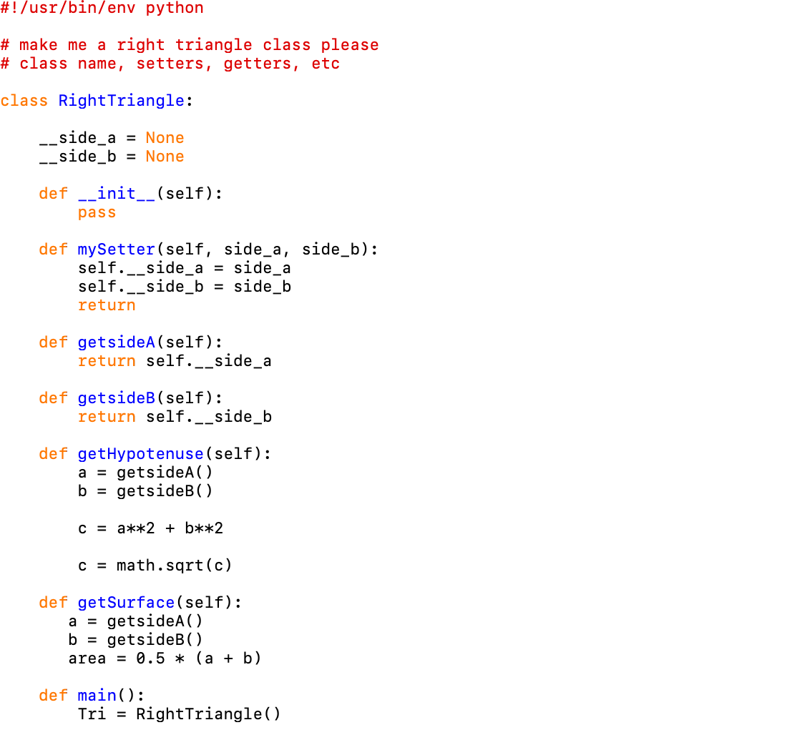
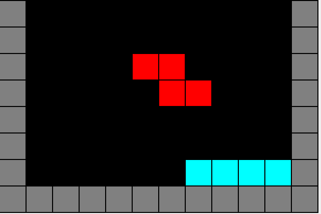
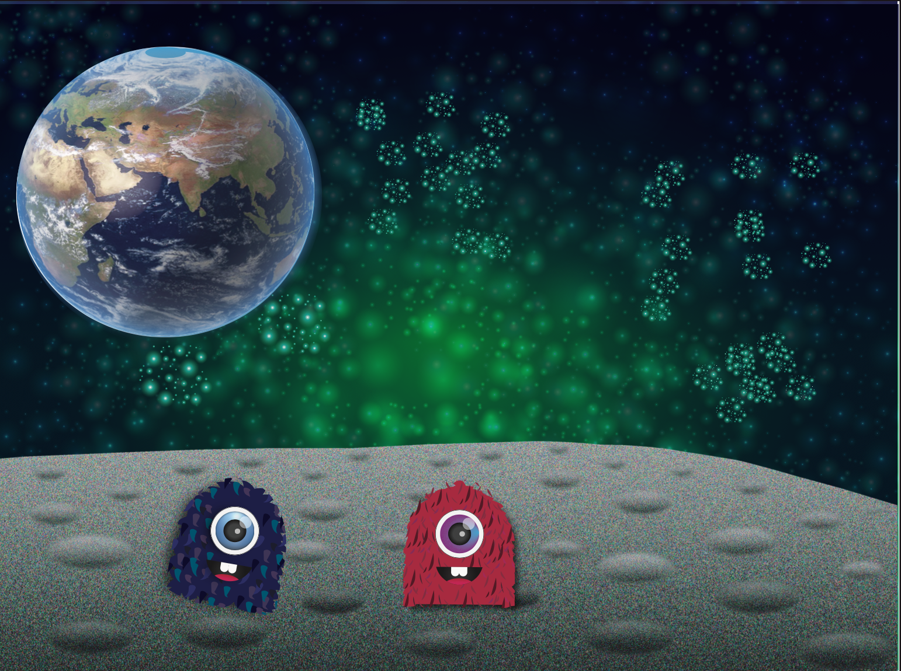
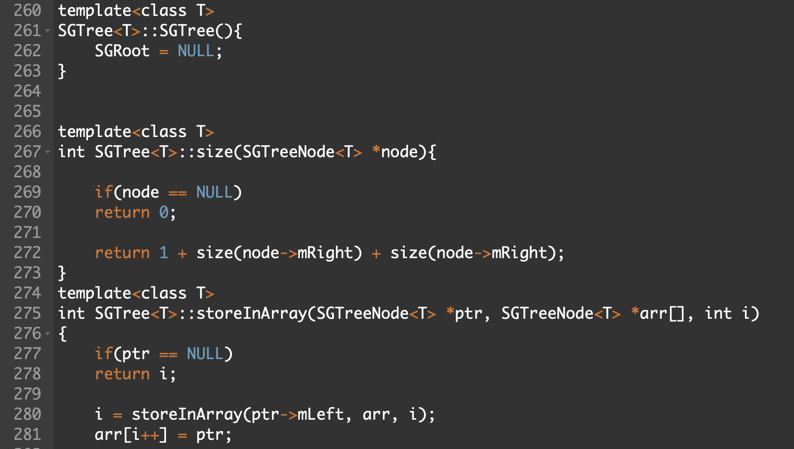

Portfolio
=========

Programming And Graphic Projects
--------------------

*For access to my private project repositories, please [email me](mailto:mmstewart@csustudent.net?subject=GitHub%20Access) with the subject line, GitHub Access.

---
### [RightTraingle | Scripting CSCI 301](./project1.md)

---
### [Tetris | Java CSCI 325](./project2.md)

---
### [Creature Project| Visual Basic](./project3.md)

---
### [Binary Search Tree| Data Structures CSCI 315](./project4.md)

---

Ethics Papers
-------------

### [Applied Networking's Ethic Paper](/pdf/Lin_Ethics_Paper.pdf)

-   **Class: Applied Networking**  
-   **Grade: B **

### [Data Structures Ethic Paper](/pdf/West_Ethics_Paper.pdf)

-   **Class: Data Structure**  
-   **Grade: A **

### [Scripting Ethic Paper Paper ](/pdf/Session_Ethic_Paper.pdf)

-   **Class: Scripting** 
-   **Grade: A **

---

Page template forked from <a href="https://github.com/csu-cs/csci-portfolio">CSU-CS</a>

<!-- Remove above link if you don't want to attributive -->
