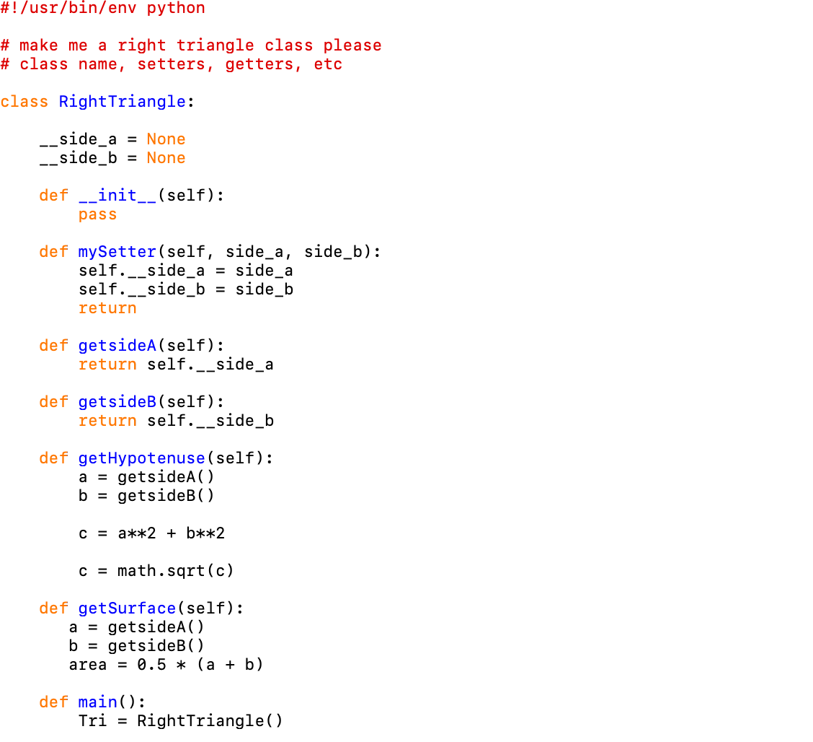

[Back to Portfolio](./index.md)

Project 1 RightTriangle
===============

-   **Class: CSCI 301 ** 
-   **Grade: A**
-   **Language(s):Python**
-   **Source Code Repository:** [Source Code](https://github.com/Malik526/RightTriangle_SrcCode.git)  
    (Please [email me](mailto:example@csustudent.net?subject=GitHub%20Access) to request access.)

## Project description
Create a right triangle and create funtions to get the side lengths , hypoteneuse and surface area. 

## How to compiles / run the program

bash
```compile```
Compile: chmod +x RightTriangle.py
Run: ./RightTriangle.py
Just run "Run" in IDLE


```bash
cd ./project
python setup.py
```

## UI Design
The user is able type in the lengths of the triangle directly into the program or the program can be tweaked to prompt the user to type in the lengths for sideA and sideB when the prgram runs.


Fig 1. The launch screen


Fig 2. Example output after input is processed.


[Back to Portfolio](./index.md)
