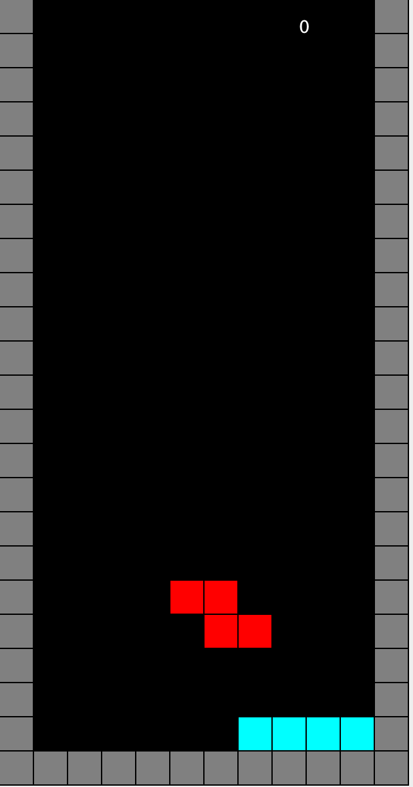

[Back to Portfolio](./index.md)

Project 2 Tetris
===============

-   **Class: CSCI 315 Object Oriented** 
-   **Grade: 89**
-   **Language(s):Java**
-   **Source Code Repository:** [Source Code](https://github.com/Malik526/Tetris-SrcCode.git)  
    (Please [email me](mailto:example@csustudent.net?subject=GitHub%20Access) to request access.)

## Project description

The goal of this project was to recreate a simple version of the game Tetris using Java. 

## How to compiles / run the program

In order to run the program just use "Run" in an IDE like IntelliJ. The class "Gameframe.java" will then run the code and start the game.

```bash
cd ./project
python setup.py
```

## UI Design

The UI design consist of using the arrow keys and spacebar on their keybaord to move and rotate the falling blocks and try to get thenm into place. The graphical design features a black backgorund and grey block borders for contrast so the user can easily see how much space they have to manuever the falling blocks. The blocks are also bright and and colorful in contrast with the black backgroundd so users can easily iddentify the blocks they are interacting with. 


Fig 1. The launch screen

[Back to Portfolio](./index.md)

