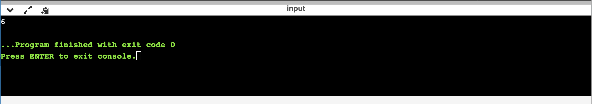

[Back to Portfolio](./index.md)

Project 4 Binary Search Tree
===============

-   **Class: CSCI 315 Data Structures ** 
-   **Grade: B**
-   **Language(s):C++**
-   **Source Code Repository:** [Source Code](https://github.com/Malik526/SearchTree_SrcCode.git)  
    (Please [email me](mailto:mmstewart@csustudent.net) to request access.)

## Project description
(1) Pick two balanced binary search tree implementations (AVL, Red-Black, ScapeGoat, 2-3, AA,
Splay, Treap, etc) and implement my interface.
(2) Next, research what situations each perform better or worse in. Namely:
The situation one exhibits better performance. Sho that is the case.
(3) Then generate test cases and show one performing better than the other. Generate a performance graph.
## How to compiles / run the program

bash
```compile```
AIN=src/main.cpp
SRCS := $(filter-out $(MAIN),$(wildcard src/*.cpp))
CFLAGS=-g -I src/
.PHONY: clean test all
BIN=bt-test

all:
	g++ -o ${BIN} $(CFLAGS) ${SRCS} ${MAIN}

run: all
	./${BIN}

%test:
	cxxtestgen --runner=ErrorPrinter -o tests/test-runner.cpp tests/$@.cpp ${SRCS}
	g++ ${CFLAGS} tests/test-runner.cpp $(SRCS) -o test-runner
	./test-runner

clean:
	rm -rf ${BIN} tests/test-runner.cpp test-runner

Run "make" in terminal while in the correct directrory


## UI Design
This program utilizes creating a search tree in main and running the functions from binarytree.cpp


Fig 1. The launch screen


Fig 2. Output
[Back to Portfolio](./index.md)

