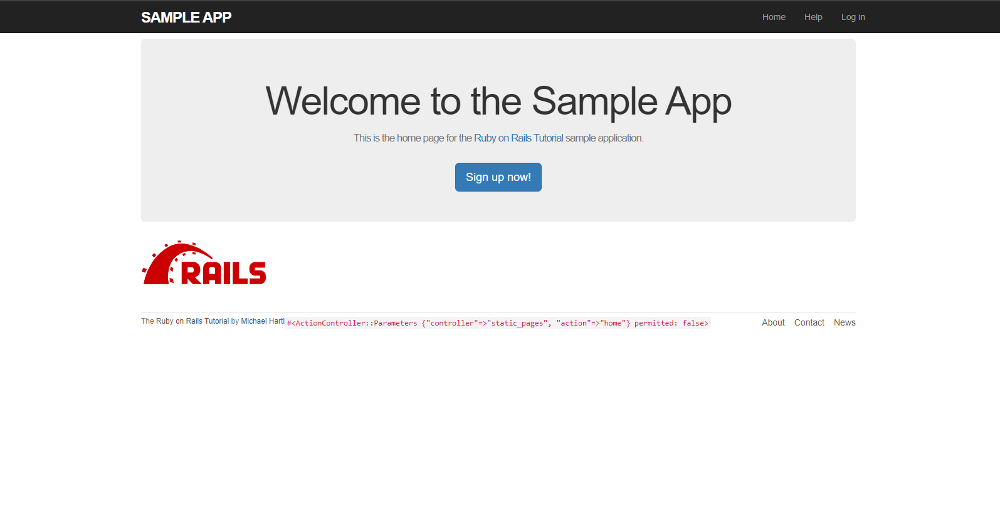

[Back to Portfolio](./index.md)

Project 5 SampleApp
===============

-   **Class: CSCI 334 User Interface Programming** 
-   **Grade: To Be Graded**
-   **Language(s): Ruby on Rails**
-   **Source Code Repository:** [Source Code](https://github.com/Malik526/sample_app.git) (Please [email me](mailto:mmstewart@csustudent.net?subject=GitHub%20Access) to request access.)
-   **Website Link:** [Sample App](https://salty-headland-27919.herokuapp.com/)
    

## Project description

The goal of the Ruby on Rails sample application tutorial is to teach beginners and intermediate developers the fundamental concepts, best practices, and techniques for building web applications using the Ruby on Rails framework. 

## How to compiles / run the program

In order to run the app you have to open up the AWS Cloud 9 IDE. Move into the "sample_app" directory and run "rails server" in order to run the server. After that you can preview the web app in the browser. You can also test for errors in the program by run ning "rails test".  

```envionment
cd sample_app
rails server #runs server for web app\
rails test #test program for errors
```

## UI Design
The UI design consit of 4 webpages that makes up this web app. The 4 webv pages are "Home", "Help", "Login", "Sign Up", and "Contact Us". Each wweb page has a header and a footer that features links for navigation to each web page on the site. When the user loadds the website they are greeted on the home page and confrontedd with a call to action button that says "Sign up now!" indicating for the user to sign up on the site. 


Fig 1. The Home Page

[Back to Portfolio](./index.md)


